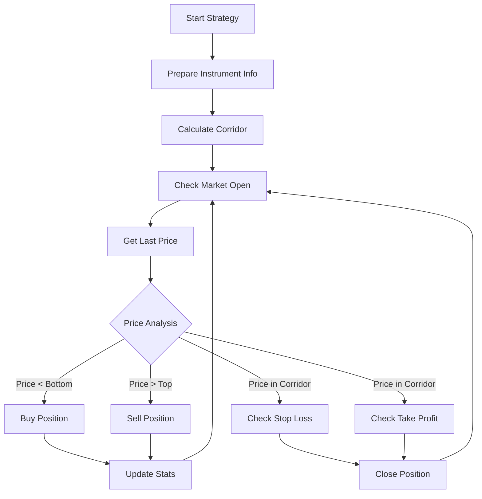

# Project Analysis: Tinkoff Trading Bot

## Overview

This is a **Tinkoff Trading Bot** (named `qwertyo1`) that was the winner of the Tinkoff Invest Robot Contest on June 1, 2022. It's an automated trading bot that trades on the Tinkoff broker platform using the Tinkoff Investments API.

## Core Functionality

The bot implements an **Interval Trading Strategy** that:

1. **Buys at the lowest price** within a calculated price interval
2. **Sells at the highest price** within the same interval
3. **Uses statistical analysis** of historical price data to determine optimal entry and exit points
4. **Manages positions** with stop-loss and take-profit mechanisms
5. **Supports multiple instruments** simultaneously

## Architecture

### Main Components

```
app/
├── main.py                    # Entry point - orchestrates bot execution
├── client.py                  # Tinkoff API client wrapper
├── settings.py                # Configuration management
├── sqlite/                    # SQLite database for stats storage
│   ├── client.py
│   └── sqlite_client.py
├── stats/                     # Statistics handling
│   ├── handler.py
│   └── sqlite_client.py
├── strategies/                # Trading strategies
│   ├── base.py                # Base strategy class
│   ├── strategy_fabric.py     # Strategy factory pattern
│   ├── errors.py
│   ├── models.py
│   └── interval/              # Interval strategy implementation
│       ├── IntervalStrategy.py
│       └── models.py
├── instruments_config/        # Instrument configuration parsing
│   ├── parser.py
│   └── models.py
└── utils/                     # Utility functions
    ├── portfolio.py
    ├── quantity.py
    └── quotation.py
```

### Key Design Patterns

1. **Strategy Pattern**: Uses a factory pattern to resolve and instantiate different trading strategies
2. **Async/Await**: All operations are asynchronous for non-blocking execution
3. **SQLite Storage**: Persistent storage for trade statistics
4. **Event-Driven**: Uses asyncio tasks for concurrent strategy execution

## Interval Strategy Details

### How It Works

1. **Corridor Calculation**:
   - Collects historical price data (1-minute candles) for a configurable period (default: last N days)
   - Calculates price percentiles to determine the trading corridor
   - Default: 80% of prices (10th to 90th percentile)

2. **Entry Points**:
   - **Buy**: When price drops below the corridor bottom
   - **Sell**: When price rises above the corridor top

3. **Position Management**:
   - **Quantity Limit**: Maximum shares to hold per instrument
   - **Stop Loss**: Automatic sell when price drops by a configurable percentage
   - **Take Profit**: Automatic sell when price reaches corridor midpoint
   - **Position Closing**: Closes all positions at end of trading day

4. **Risk Management**:
   - Prevents re-processing of stop-loss triggers within the same day
   - Validates order quantities to ensure they match instrument lot sizes
   - Handles both long and short positions

### Configuration Parameters

- `interval_size`: Percent of prices to include in interval (default: 80%)
- `days_back_to_consider`: Number of days for historical data (default: configurable)
- `check_interval`: Time in seconds between checks (default: configurable)
- `stop_loss_percent`: Stop loss threshold percentage (default: configurable)
- `quantity_limit`: Maximum position size (default: configurable)

## Technical Stack

- **Language**: Python 3.9+
- **Async Framework**: asyncio
- **API**: Tinkoff Investments API (gRPC)
- **Data Processing**: NumPy for statistical calculations
- **Database**: SQLite for trade statistics
- **Testing**: pytest with fixtures for backtesting
- **Build Tool**: Makefile for common operations

## Key Features

1. **Multi-Instrument Support**: Can trade multiple instruments simultaneously
2. **Backtesting**: Built-in backtesting framework in `tests/strategies/interval/backtest/`
3. **Statistics Tracking**: Comprehensive trade statistics stored in SQLite
4. **Sandbox Mode**: Supports sandbox environment for testing
5. **Account Management**: Tool to retrieve account IDs
6. **Real-time Monitoring**: Logging and statistics display tools

## Project Structure

### Core Modules

1. **`app/main.py`**: Main entry point that initializes the bot and starts all strategies
2. **`app/client.py`**: Wrapper for Tinkoff API client with async operations
3. **`app/settings.py`**: Configuration management using environment variables
4. **`app/strategies/interval/IntervalStrategy.py`**: Core trading strategy implementation (20,915 lines)
5. **`app/strategies/strategy_fabric.py`**: Factory pattern for strategy resolution
6. **`app/instruments_config/parser.py`**: Configuration file parser for instruments
7. **`app/stats/handler.py`**: Statistics tracking and reporting
8. **`app/sqlite/client.py`**: SQLite database client for stats storage

### Utility Modules

1. **`app/utils/portfolio.py`**: Portfolio position management
2. **`app/utils/quantity.py`**: Order quantity validation
3. **`app/utils/quotation.py`**: Price conversion utilities

### Tools

1. **`tools/display_stats.py`**: Display trade statistics
2. **`tools/get_accounts.py`**: Retrieve Tinkoff account information

### Tests

1. **`tests/strategies/interval/backtest/conftest.py`**: Backtesting fixtures and configuration
2. **`tests/strategies/interval/backtest/test_on_historical_data.py`**: Historical data testing

## Usage

### Setup

1. Generate Tinkoff token from settings
2. Create `.env` file with required variables
3. Create `instruments_config.json` with instrument configurations
4. Install dependencies: `pip install -r requirements.txt`
5. Run bot: `make start`

### Configuration Files

**`.env`**:
- `TOKEN`: Tinkoff API token
- `ACCOUNT_ID`: Account ID (optional)
- `SANDBOX`: Set to `false` for real trading

**`instruments_config.json`**:
- List of instruments with FIGI IDs and strategy configurations

### Commands

- `make start`: Run the trading bot
- `make get_accounts`: Get account information
- `make backtest`: Run backtest on historical data
- `make display_stats`: Display trade statistics

## Strategy Logic Flow



## Risk Management Features

1. **Stop Loss**: Automatic position closure when price drops by configured percentage
2. **Take Profit**: Automatic position closure when price reaches target level
3. **Quantity Validation**: Ensures orders match instrument lot sizes
4. **Daily Reset**: Clears stop-loss triggers at end of trading day
5. **Position Limits**: Maximum position size per instrument

## Statistics Tracking

The bot tracks:
- Order execution details
- Trade performance metrics
- Position changes
- Corridor calculations
- Market status

Statistics are stored in SQLite database for analysis and reporting.

## Backtesting

The project includes a comprehensive backtesting framework:
- Historical data testing
- Strategy performance evaluation
- Results saved to text files
- Configurable test parameters (FIGI, commission, strategy config, date range)

## Conclusion

This is a sophisticated automated trading bot that implements a statistical interval trading strategy on the Tinkoff broker platform. It demonstrates:

- **Advanced Python async programming**
- **Statistical trading strategies**
- **Risk management implementation**
- **API integration with Tinkoff Investments**
- **Comprehensive testing and backtesting**
- **Production-ready architecture**

The bot was recognized as a winner in the Tinkoff Invest Robot Contest, indicating successful implementation and effectiveness of the trading strategy.